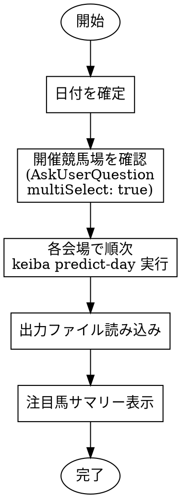

# predict-day

## Overview

指定日の競馬レースを予測するワークフロー。`keiba predict-day`コマンドで会場ごとに全レースを予測する。

## When to Use

- 明日/今日/特定日のレース予測を依頼された
- 競馬場を指定されたレース予測
- 「予想して」「予測して」など予測依頼
- 「明日の予測」「今日の予想」など日付付き依頼

## Workflow



## Quick Reference

### 予測コマンド
```bash
# 今日の予測（デフォルト）
keiba predict-day --venue 中山 --db data/keiba.db

# 日付指定（未来日付対応）
keiba predict-day --venue 中山 --date 2026-02-01 --db data/keiba.db

# ML予測スキップ
keiba predict-day --venue 中山 --no-ml --db data/keiba.db
```

### 出力ファイルパス
```
docs/predictions/YYYY-MM-DD-venue.md
```
例: `docs/predictions/2026-01-31-nakayama.md`

### 有効な会場名
```
中山、京都、東京、阪神、中京、新潟、札幌、函館、福島、小倉
```

## Implementation

### 1. 日付を確定

- 「明日」なら明日の日付を計算 (datetime.date.today() + timedelta(days=1))
- 「今日」なら今日の日付を使用 (datetime.date.today())
- 日付指定があればそれを使用 (YYYY-MM-DD形式)
- 指定なしの場合は今日をデフォルト

### 2. 開催競馬場を確認

**CRITICAL: 必ず AskUserQuestion ツールを使用**

手動でテキストで質問するのではなく、AskUserQuestion ツールを呼び出す:

```python
AskUserQuestion(
    questions=[{
        "question": "予測する競馬場を選択してください（複数選択可）",
        "header": "競馬場選択",
        "multiSelect": True,  # 必須: 複数選択を有効化
        "options": [
            {"label": "中山", "description": "中山競馬場"},
            {"label": "京都", "description": "京都競馬場"},
            {"label": "東京", "description": "東京競馬場"},
            {"label": "阪神", "description": "阪神競馬場"},
            {"label": "中京", "description": "中京競馬場"},
            {"label": "新潟", "description": "新潟競馬場"},
            {"label": "札幌", "description": "札幌競馬場"},
            {"label": "函館", "description": "函館競馬場"},
            {"label": "福島", "description": "福島競馬場"},
            {"label": "小倉", "description": "小倉競馬場"}
        ]
    }]
)
```

### 3. 各会場でpredict-day実行

**CRITICAL: 順次実行が必須（並列実行禁止）**

レート制限のため、会場ごとに順次実行する:

```bash
# 会場1
keiba predict-day --venue 中山 --date 2026-01-31 --db data/keiba.db

# 会場2（会場1の完了後）
keiba predict-day --venue 京都 --date 2026-01-31 --db data/keiba.db
```

### 4. 出力ファイル読み込み

各会場の予測ファイルを読み込む:
- パス: `docs/predictions/YYYY-MM-DD-{venue}.md`
- 例: `docs/predictions/2026-01-31-nakayama.md`

### 5. 注目馬サマリー表示

各会場ごとに注目馬をテーブル形式で表示:

```markdown
### 中山競馬場 (2026-01-31)

| レース | 注目馬 | 馬番 | 理由 |
|:---:|:---|:---:|:---|
| 1R | ○○号 | 3 | コース適性高、直近好走 |
| 2R | △△号 | 5 | タイム指数トップ |
...
```

## Rate Limiting

**CRITICAL:** predict-day は1会場あたり約12-14リクエストをnetkeibaに送信

- グローバルレートリミッタが全スクレイパーインスタンス間でリクエスト間隔を制御
- HTTPエラー（403/429/503）時に指数バックオフでリトライ（5秒, 10秒, 30秒）
- 複数会場は必ず順次実行（並列実行するとレート制限違反）

**誤った実装例:**
```python
# NG: 並列実行（レート制限違反）
Task(subagent_type="general-purpose", prompt="中山の予測")
Task(subagent_type="general-purpose", prompt="京都の予測")
```

**正しい実装例:**
```python
# OK: 順次実行
# 1. 中山の予測完了を待つ
# 2. 京都の予測を開始
```

## Output

predict-dayコマンドは Markdown ファイルを生成:

```markdown
# 中山競馬場 - 2026-01-31

## 1R (10:00) ダ1200m

### 予測トップ3
1. 3番 ○○号 (スコア: 85.2)
2. 5番 △△号 (スコア: 82.1)
3. 7番 □□号 (スコア: 79.8)

### ファクター分析
| 馬番 | 馬名 | 過去成績 | コース適性 | タイム指数 | 上がり3F | 人気 | 血統 | 脚質 | 総合スコア |
|:---:|:---|:---:|:---:|:---:|:---:|:---:|:---:|:---:|:---:|
| 3 | ○○号 | 88.5 | 92.0 | 85.0 | 78.5 | 65.0 | 75.0 | 82.0 | 85.2 |
| 5 | △△号 | 82.0 | 88.0 | 79.5 | 85.0 | 70.0 | 68.0 | 80.5 | 82.1 |
...

### ML予測
| 馬番 | 馬名 | 3着以内確率 | 期待値 |
|:---:|:---|:---:|:---:|
| 3 | ○○号 | 42.3% | 1.27 |
| 5 | △△号 | 38.7% | 1.16 |
...
```

## Common Mistakes

| 問題 | 解決策 |
|------|--------|
| AskUserQuestion を使わずに手動で質問 | 必ず AskUserQuestion ツールを使用（multiSelect: true 設定） |
| 「race_idが見つかりません」 | 開催日・会場を再確認。未来日付は自動フォールバック対応済み |
| 複数会場を並列実行 | 順次実行に変更（レート制限のため） |
| 会場名が不正 | 有効な会場名リストを参照（中山、京都など10会場） |
| MLモデルがない警告 | `keiba train` でモデル学習、または --no-ml で続行 |

## Example Session

```
User: 明日の中山と京都の予想をして

Claude:
1. 日付確定: 2026-02-01 (明日)
2. 競馬場確認: [AskUserQuestion で中山・京都を確認]
3. 中山の予測実行:
   keiba predict-day --venue 中山 --date 2026-02-01 --db data/keiba.db
   → docs/predictions/2026-02-01-nakayama.md 生成完了
4. 京都の予測実行（中山完了後）:
   keiba predict-day --venue 京都 --date 2026-02-01 --db data/keiba.db
   → docs/predictions/2026-02-01-kyoto.md 生成完了
5. 注目馬サマリー:

### 中山競馬場 (2026-02-01)

| レース | 注目馬 | 馬番 | スコア | 理由 |
|:---:|:---|:---:|:---:|:---|
| 1R | ○○号 | 3 | 85.2 | コース適性高、直近好走 |
| 2R | △△号 | 5 | 82.1 | タイム指数トップ、血統良 |

### 京都競馬場 (2026-02-01)

| レース | 注目馬 | 馬番 | スコア | 理由 |
|:---:|:---|:---:|:---:|:---|
| 1R | □□号 | 7 | 79.8 | 上がり3F優秀 |
| 2R | ××号 | 2 | 88.5 | ML予測1位、総合力高 |
```
