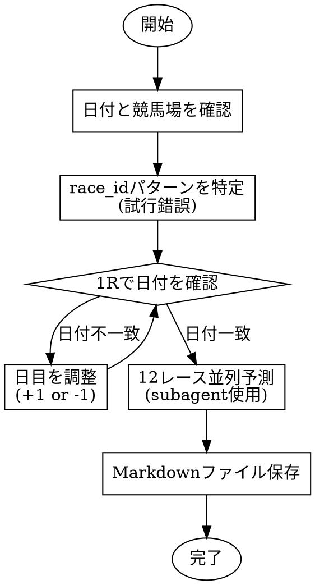

# predict-race

## Overview

未来の競馬レースを予測するワークフロー。`predict-day`コマンドは過去データを参照するため使えない。代わりに出馬表URLから直接予測を実行する。

## When to Use

- 明日（または未来の日付）のレース予測を依頼された
- 「中山の予測」「京都のレース」など競馬場を指定された
- predict-dayコマンドで「レースが見つかりません」と表示された

## Workflow



## race_id Structure

```
YYYY + 場所コード(2桁) + 回(2桁) + 日目(2桁) + レース番号(2桁)
```

例: `202606010901` = 2026年 + 中山(06) + 1回 + 9日目 + 1R

### 競馬場コード

| 競馬場 | コード | 競馬場 | コード |
|:---:|:---:|:---:|:---:|
| 札幌 | 01 | 中山 | 06 |
| 函館 | 02 | 中京 | 07 |
| 福島 | 03 | 京都 | 08 |
| 新潟 | 04 | 阪神 | 09 |
| 東京 | 05 | 小倉 | 10 |

### 開催日目の推定

JRAは週末のみ開催。開催初日からカウント：
- 1回開催は通常8日間（4週末）
- 土曜=奇数日目、日曜=偶数日目

例：1月開催が1/4(土)開始の場合
- 1/4(土)=1日目, 1/5(日)=2日目
- 1/11(土)=3日目, 1/12(日)=4日目
- ...

## Quick Reference

### race_id特定コマンド
```bash
# まず1Rで日付を確認
python3 -m keiba predict --url "https://race.netkeiba.com/race/shutuba.html?race_id=YYYYVVRRDD01" --db data/keiba.db 2>&1 | head -5
```

- YYYY: 年
- VV: 競馬場コード
- RR: 開催回（通常01）
- DD: 日目（01-08を試行）

### 予測実行（並列）
```bash
# 各レースを予測
python3 -m keiba predict --url "https://race.netkeiba.com/race/shutuba.html?race_id={race_id}" --db data/keiba.db
```

## Implementation

1. **日付・競馬場を確認**
   - 対象日付（YYYY-MM-DD形式）
   - 競馬場名（中山、京都など）

2. **race_idを特定**
   - 競馬場コードを取得
   - 開催回を推定（通常01、年後半なら02-05）
   - 日目を試行錯誤で特定
   - 1Rを実行して日付が一致するか確認

3. **全レース予測を並列実行**
   - 2つのsubagentを起動（中山用、京都用など）
   - 各subagentが12レース分を実行
   - 結果をMarkdownにまとめる

4. **出力ファイル**
   - パス: `docs/predictions/YYYY-MM-DD-venue.md`
   - venue: nakayama, kyoto, tokyo, hanshin など

## Output Format

```markdown
# YYYY-MM-DD 競馬場 予測結果

生成日時: YYYY-MM-DD HH:MM:SS

## 1R レース名
race_id: XXXXXXXXXXXX
コース情報

| 順位 | 馬番 | 馬名 | ML確率 | 総合 |
|:---:|:---:|:---|:---:|:---:|
| 1 | X | 馬名 | -% | XX.X |
...（上位5頭）
```

## Common Mistakes

| 問題 | 解決策 |
|------|--------|
| predict-dayで「レースが見つかりません」 | 未来のレースはpredictコマンドを直接使用 |
| 日付が1週間ずれている | 日目(DD)を+7または-7して調整 |
| 開催がない | netkeibaカレンダーで開催有無を確認 |
| 新馬戦で予測データなし | 過去データがないため予測不可（馬番順表示） |

## Example Session

```
User: 明日の中山と京都のレースを予測して

Claude:
1. 日付確認: 2026-01-25
2. 競馬場: 中山(06), 京都(08)
3. race_id特定:
   - 中山1R: 202606010901 で試行 → 日付確認
   - 日付が1/25なら正解、違えば日目を調整
4. 並列実行: 2つのsubagentで中山12R + 京都12R
5. 出力: docs/predictions/2026-01-25-nakayama.md, 2026-01-25-kyoto.md
```
