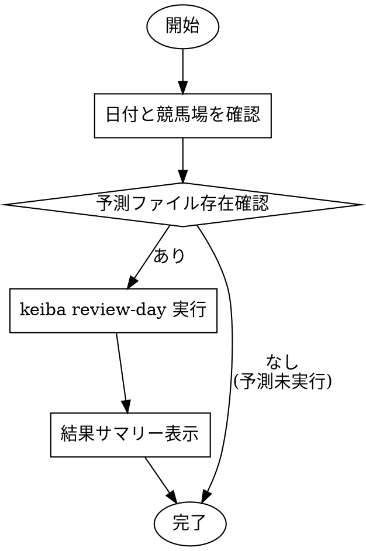

# review-day

## Overview

予測結果の検証ワークフロー。`keiba review-day`コマンドで予測と実際の結果を比較し、的中率・回収率を確認する。

## When to Use

- 予測結果の検証を依頼された
- 「昨日の結果は？」「的中した？」など結果確認
- レース終了後の予測精度チェック

## Workflow



## Quick Reference

### 検証コマンド
```bash
# 今日の検証（デフォルト）
keiba review-day --venue 中山 --db data/keiba.db

# 日付指定
keiba review-day --venue 中山 --date 2026-01-25 --db data/keiba.db
```

### 予測ファイルパス
```
docs/predictions/YYYY-MM-DD-venue.md
```
例: `docs/predictions/2026-01-25-nakayama.md`

## Implementation

1. **日付・競馬場を確認**
   - 対象日付（デフォルト: 今日）
   - 競馬場名（中山、京都など）

2. **予測ファイル存在確認**
   - `docs/predictions/YYYY-MM-DD-venue.md` を確認
   - なければ検証不可を通知

3. **review-day実行**
   ```bash
   keiba review-day --venue {venue} --date {date} --db data/keiba.db
   ```

4. **結果サマリー表示**
   - 各競馬場ごとのテーブル（6種類の馬券種別）
   - 全競馬場合計テーブル
   - 総評コメント

   馬券種別（6種類）:
   1. 複勝（予測1位）
   2. 複勝（予測1-3位）
   3. 馬連（3点買い）
   4. 3連複（1点買い）
   5. 単勝（予測1位）
   6. 単勝（予測1-3位）

## Output

review-dayコマンドは予測ファイルに検証結果を追記する:

```markdown
## 検証結果

| レース | 予測1位 | 結果 | 的中 |
|:---:|:---:|:---:|:---:|
| 1R | 5番 | 3着 | ○ |
| 2R | 3番 | 8着 | × |
...

### 中山競馬場

| 馬券種別 | 的中率 | 投資額 | 払戻額 | 損益 | 回収率 |
|:---|:---:|:---:|:---:|:---:|:---:|
| 複勝（予測1位） | 58.3% (7/12) | 1,200円 | 870円 | -330円 | 72.5% |
| 複勝（予測1-3位） | 47.2% (17/36) | 3,600円 | 2,330円 | -1,270円 | 64.7% |
| 馬連（3点買い） | 41.7% (5/12) | 3,600円 | 3,480円 | -120円 | 96.7% |
| 3連複（1点買い） | 16.7% (2/12) | 1,200円 | 1,470円 | +270円 | 122.5% |
| 単勝（予測1位） | 25.0% (3/12) | 1,200円 | 490円 | -710円 | 40.8% |
| 単勝（予測1-3位） | 75.0% (9/12) | 3,600円 | 2,710円 | -890円 | 75.3% |

### 全競馬場合計

| 馬券種別 | 的中率 | 投資額 | 払戻額 | 損益 | 回収率 |
|:---|:---:|:---:|:---:|:---:|:---:|
| 複勝（予測1位） | 58.3% (14/24) | 2,400円 | 1,780円 | -620円 | 74.2% |
| 複勝（予測1-3位） | 47.2% (34/72) | 7,200円 | 4,660円 | -2,540円 | 64.7% |
| 馬連（3点買い） | 41.7% (10/24) | 7,200円 | 6,960円 | -240円 | 96.7% |
| 3連複（1点買い） | 16.7% (4/24) | 2,400円 | 2,940円 | +540円 | 122.5% |
| 単勝（予測1位） | 25.0% (6/24) | 2,400円 | 980円 | -1,420円 | 40.8% |
| 単勝（予測1-3位） | 75.0% (18/24) | 7,200円 | 5,420円 | -1,780円 | 75.3% |

### 総評
複勝（予測1位）の的中率が58.3%と安定。3連複が回収率122.5%でプラス収支。
```

## Common Mistakes

| 問題 | 解決策 |
|------|--------|
| 「予測ファイルがありません」 | 先にpredict-raceで予測を実行 |
| 「レース結果がありません」 | レース終了後に実行（当日夕方以降） |
| 結果が反映されない | scrapeで最新データ取得後に再実行 |

## Example Session

```
User: 昨日の中山の予測結果を確認して

Claude:
1. 日付確認: 2026-01-24
2. 競馬場: 中山
3. 予測ファイル確認: docs/predictions/2026-01-24-nakayama.md あり
4. 実行: keiba review-day --venue 中山 --date 2026-01-24 --db data/keiba.db
5. 結果サマリー表示:

### 中山競馬場

| 馬券種別 | 的中率 | 投資額 | 払戻額 | 損益 | 回収率 |
|:---|:---:|:---:|:---:|:---:|:---:|
| 複勝（予測1位） | 58.3% (7/12) | 1,200円 | 870円 | -330円 | 72.5% |
| 複勝（予測1-3位） | 47.2% (17/36) | 3,600円 | 2,330円 | -1,270円 | 64.7% |
| 馬連（3点買い） | 41.7% (5/12) | 3,600円 | 3,480円 | -120円 | 96.7% |
| 3連複（1点買い） | 16.7% (2/12) | 1,200円 | 1,470円 | +270円 | 122.5% |
| 単勝（予測1位） | 25.0% (3/12) | 1,200円 | 490円 | -710円 | 40.8% |
| 単勝（予測1-3位） | 75.0% (9/12) | 3,600円 | 2,710円 | -890円 | 75.3% |

総評: 複勝（予測1位）の的中率が58.3%と安定。3連複が回収率122.5%でプラス収支。
```
